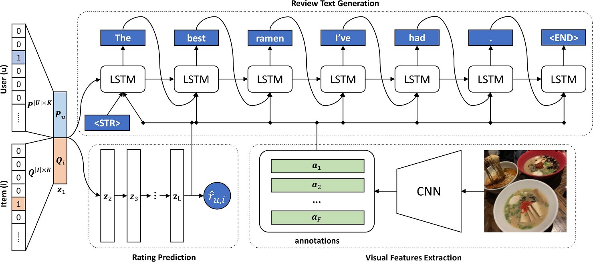

# MRG: Multimodal Review Generation

This is the code for the paper:

**[Multimodal Review Generation for Recommender Systems](https://drive.google.com/file/d/12RSrAxp9O5YPPoazoAu5Frc-c0X4Rtyq)**
<br>
[Quoc-Tuan Truong](http://www.qttruong.info/) and [Hady W. Lauw](http://www.hadylauw.com/)
<br>
Presented at [WWW 2019](https://www2019.thewebconf.org/)



We provide:

- Code to train and evaluate the model
- [Sample data](http://static.preferred.ai/mrg/data.zip) to run an experiment with MRG

If you find the code and data useful in your research, please cite:

```
@inproceedings{truong2019mrg,
 title={Multimodal Review Generation for Recommender Systems},
 author={Truong, Quoc-Tuan and Lauw, Hady W},
 booktitle={The World Wide Web Conference, {WWW} 2019}
 year={2019},
}
```

## Requirements

- Python 3
- Tensorflow >=1.12,<2.0
- Hickle
- Tqdm
- [GloVe](https://nlp.stanford.edu/projects/glove/) word embeddings

## How to run

```bash
python train.py --data_dir ./data --batch_size 64 --learning_rate 0.001 --num_epochs 20
```

Training arguments:

```bash
python train.py --help
```
```
optional arguments:
  -h, --help            show this help message and exit
  --data_dir            DATA_DIR
                        Path to the data directory
  --learning_rate       LEARNING_RATE
                        Learning rate (default: 3e-4)
  --dropout_rate        DROPOUT_RATE
                        Probability of dropping neurons (default: 0.2)
  --lambda_reg          LAMBDA_REG
                        Lambda hyper-parameter for regularization (default: 1e-4)
  --num_epochs          NUM_EPOCHS
                        Number of training epochs (default: 20)
  --batch_size          BATCH_SIZE
                        Batch size of reviews (default: 64)
  --num_factors         NUM_FACTORS
                        Number of latent factors for users/items (default: 256)              
  --word_dim            WORD_DIM
                        Word embedding dimensions (default: 200)
  --lstm_dim            LSTM_DIM
                        Hidden dimensions of the LSTM Cell (default: 256)
  --max_length          MAX_LENGTH
                        Maximum length of reviews to be generated (default: 20)
  --display_step        DISPLAY_STEP
                        Display info after number of steps (default: 10)
  --allow_soft_placement ALLOW_SOFT_PLACEMENT
                        Allow device soft device placement
```

## Contact
Questions and discussion are welcome: www.qttruong.info